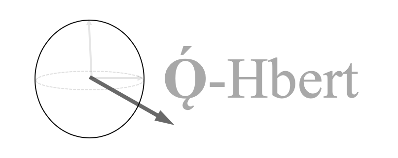

# 

## Introduction
Ǫ́-Hbert is a Quantum Computing library that reconstructs quantum states using Machine Learning.

Please read the following [PAPER ](https://arxiv.org/abs/1810.10584). All implementation is
in conjunction with the findings of the paper.

## Getting Started
For a quick start, please ensure the following.

* Clone the repository:
    In an appropriate directory run the following command on your Terminal:

    `git clone https://github.com/akshat998/Q-Hbert.git`

* Make sure you `cd` into the right directory.

   `cd Q-Hbert/`

## Features

## Documentation

## Contributing

## Acknowledgment
